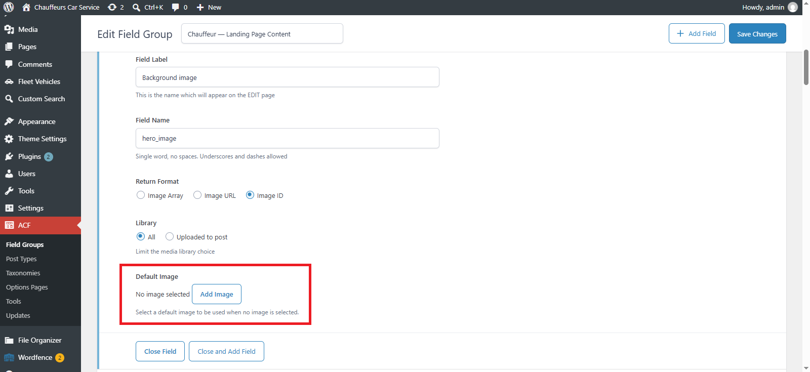

# Default Image for ACF

[](https://www.gnu.org/licenses/gpl-2.0.html)
[](https://wordpress.org/)
[](https://wordpress.org/)
[](https://www.php.net/)

> Easily set a fallback default image for Advanced Custom Fields (ACF) image fields when no image is selected.

---

## 📌 Overview

**Default Image for ACF** allows WordPress developers and content creators to set a default fallback image directly inside Advanced Custom Fields (ACF) Image field settings.

When editing a post, page, or custom post type where an ACF Image field is left empty, the plugin automatically provides the specified default image. This prevents broken layouts, eliminates repetitive fallback conditional checks in your PHP theme templates, and ensures seamless visual display across your entire WordPress site.

Developed and maintained by **[Abdul Rehman](https://profiles.wordpress.org/abdulrehmanirfan/)** and **[Gillan e Solution](https://gillan.co/)**.

---

## 🚀 Key Features

* **Native ACF Field Setting**: Adds a clean "Default Image" uploader directly inside ACF Image field settings in the admin.
* **Automatic Dynamic Fallback**: Returns the configured default image whenever a post or page has no image selected.
* **Full ACF Return Format Compatibility**: Works out of the box with all three ACF return formats:
  * 🖼️ **Image Array**
  * 🔗 **Image URL**
  * 🔢 **Image ID**
* **Zero Frontend Overhead**: Hooks directly into ACF's native value loading pipeline with zero database bloat.
* **PHP 8.4+ & WordPress 6.x Ready**: Strictly typed and validated using `absint()` to prevent PHP 8 `TypeError` exceptions.
* **Attachment Safeguard**: If a default image is ever deleted from your WordPress Media Library, the plugin gracefully falls back to empty rather than producing broken image tags or PHP notices.
* **ACF & SCF Compatible**: Seamlessly supports Advanced Custom Fields (Free & PRO) as well as Secure Custom Fields (SCF).
* **Developer Extensible**: Includes the `default_image_for_acf_value` filter hook for programmatic and conditional overrides.

---

## 📸 Screenshot



---

## ⚙️ Requirements

* **WordPress**: 5.8 or higher
* **PHP**: 7.4 through 8.4
* **ACF**: Advanced Custom Fields (Free or PRO) or Secure Custom Fields (SCF)

---

## 📥 Installation

### Manual Installation
1. Clone or download this repository:
   ```bash
   git clone https://github.com/Abdul-rehmanSHK/default-image-acf-addon.git
   ```
2. Place the folder into your WordPress plugins directory (`wp-content/plugins/default-image-for-acf`).
3. Navigate to **Plugins → Installed Plugins** in your WordPress admin dashboard.
4. Click **Activate** under **Default Image for ACF**.

---

## 🛠️ Usage

1. Navigate to **ACF → Field Groups** (or **Custom Fields → Field Groups**) in your WordPress dashboard.
2. Add or edit an **Image** field.
3. In the field settings, locate the **Default Image** setting.
4. Click **Add Image** to select or upload your fallback image from the Media Library.
5. Save the field group.

Now, whenever you call `get_field('your_image_field')` or `the_field('your_image_field')` on a post where no image has been uploaded, ACF will automatically return your default image formatted according to your field's configured return format (Array, URL, or ID).

---

## 💻 Developer Hooks & Extensibility

You can programmatically filter or override the fallback image using the `default_image_for_acf_value` filter:

```php
/**
 * Conditionally override the default ACF image fallback.
 *
 * @param mixed      $value      The fallback attachment ID (or empty value).
 * @param int|string $post_id    The post ID.
 * @param array      $field      The ACF field configuration array.
 * @param int        $default_id The original default attachment ID.
 * @return mixed
 */
add_filter( 'default_image_for_acf_value', function( $value, $post_id, $field, $default_id ) {
    // Example: Use a specific default image for a custom post type 'news'
    if ( get_post_type( $post_id ) === 'news' ) {
        return 456; // Attachment ID for news default image
    }

    return $value;
}, 10, 4 );
```

---

## 🌐 Internationalization (i18n)

The plugin is fully translation-ready with POT file included:
* Text Domain: `default-image-for-acf`
* Domain Path: `/languages`

---

## 📄 License

Distributed under the GNU General Public License v2 or later. See [gpl-2.0.txt](gpl-2.0.txt) for details.
